# Design Decisions

This document outlines the rationale behind our design decisions. It describes why elements are placed where they are, why certain elements appear a certain way, have certain properties and behavior, etc.

## Links to Accessibility Videos
Keyboard: https://drive.google.com/file/d/126-Yd_vv4fPBfULfAjs5wk5La_qFH7cU/view?usp=sharing
Screen Reader: https://drive.google.com/file/d/1xWWXt9yxsh13QxZBqb3J3iOVcOkt7UPC/view?usp=sharing

## Link to Native Phone App

## Modifications for Native App
For the native phone app, we thought that it would make more sense for the renaming to happen in a popup instead of directly on the text field because this is often have native phone apps handle text input. Besides that, all of the design for the app is the same as before.

## Building Native Phone App from React App with Cordova
We followed the instructions outlined in this post: https://stackoverflow.com/questions/35463547/what-is-the-quickest-way-to-convert-a-react-app-to-react-native

First, install Cordova globally by running `npm install -g cordova`.

To build the Cordova app:
1. Go into the `React App` directory and run `npm run build`.
2. Copy the contents of the `build` directory in `React App` into the `www` directory in `Cordova App`
3. Run `cordova build ios` in the `Cordova App` directory.

## App Design Philosophy
We designed our app to be something that is both visually appealing and practically useful. It was originally designed for mobile devices, and was later adapted for larger screen sizes. 

Our app has a home screen where the user can create new lists or edit/go into their existing lists. From the home screen, it is also possible to change overall app settings, which currently is just the priority emoji used for the tasks.

After the user clicks on a list, the app shows all of the tasks for that list in a slightly different view to differentiate it from the home view.

More details about both of these views can be found in the section below.

## Home Screen
The home screen has the following features:
- Create/edit/delete lists
- Display # of tasks completed / total # of tasks on wider screens
- Search 
- Sorting 
- Changing the emoji indicating different levels of priority

Lists can be created by pressing the "Add New List" button at the bottom of the screen. This brings up a popup that allows the user to name a list they would like to create. We decided to make this bring up a pop up element since this is not an action users are meant to take often (in contrast to creating tasks, see next section). From here, the user can confirm or cancel their list creation.

On existing lists in the home screen, the user can click the 3 dots next to it to bring up the option to delete or rename the task. This icon is a common icon used to open up more options. Pressing delete brings up a confirmation popup as it is a destructive action and we would like to prevent the user from accidentally deleting their list and all the tasks within that list.

The default action upon clicking a list in the home screen is the bring the user to the task view for the tasks in the list that was clicked. This is because we are following the 80/20 rule. We believe that 80% of the time the user wants to interact with the list, it is to go inside and view the tasks associated with that list.

The sorting functionality is either on the top bar or inside the main menu dropdown on the top right. This allows the user to sort their lists in an order that is convenient for them. We hope that this feature will be useful to users with multiple lists.

Inside the main menu button, we will have the sorting functionality if the screen is not wide enough to show the sorting functionality on the top bar, and we will have an option for the user to change the priority emojis used for the app. We received feedback from our testers that the emojis used to indicate the priority levels are not always intuitive/obvious to them. To fix this issue, we decided to add an option which allows users to choose their own priority emojis.

Finally, the home screen has a search bar which allows users the filter the lists they see on the home screen down to just the lists that match the search term. We anticipate that this will be useful for users with many lists or users who are looking for a specific list.
## Element Placement
We decided to place the "Add Task (+)" button on the bottom left hand corner of the screen because most people are right-handed. When holding a phone with just the right hand, the bottom-left corner is the most accesible with the right thumb. This should reduce the friction in using our to-do app. Additionally, this is an element that is likely to be used multiple times in quick succession, and it would be annoying for the user if it were to move with each usage, so it is pinned to the bottom of the app. This was a suggestion by Prof. Rhodes.
## Tasks Screen
The tasks screen has the following features:
- Return to home screen
- Create/edit/delete tasks
- Change the priority level of the task
- Mark task as complete/incomplete
- Toggle between showing all/only incomplete tasks
- Search 
- Sorting 

On the tasks screen, we have the name of the list the user is currently in centered in the top bar so that the user has information of which list they are currently in at all times while in this screen.

Deleting all tasks that are completed is a destructive action, so it would be bad if the user accidentally clicked this icon without knowing what it does. Thus, we placed this action under the menu icon in the upper right corner along with a text description. Additionally, it is not a common action, so it is okay for it to take more clicks to activate. To further mitigate this risk, we also added a confirmation popup that asks the user to confirm before deleting all completed tasks. This confirmation popup will also warn the user if their current view is not currently displaying all the tasks that will be deleted, such as when the search bar is not empty or when the user is in show only incomplete tasks mode.

On the top right of the screen, we have an arrow pointing to the left which will bring the user back to the home screen. This is a common icon and icon location used for "going up a level"

To edit a task, the user can click on the three dots icon, where they will also be able to edit other details of the task.

## Task Element

Clicking on the task (everywhere except the menu) should mark the item as completed/not-completed because this is probably the most common action most users would want to do to this item.

Priority level adjustment, deleting the task, and renaming the task can be done from the task menu as we thought these are actions that are not commonly used, and can be hidden in the task menu to maximize the surface area for marking the task complete/incomplete.

Upon talking to Alekz, one of our user testers, we actually realize that we are wrong in this for phones. For phones, clicking on the text area of the task should allow the user to rename the task, not check/uncheck the checkbox. We will change this to be the default behavior for phones in the next lab.

The checkbox goes on the left of each task as that is where it is usually positioned on a physical to-do list. We included a checkbox because otherwise, it may not be immediately obvious how to mark an item as complete/incomplete. After checking an item, we grey out the text for that task. We considered putting a strikethrough on the text for completed tasks but we ended up deciding not to for readability.

We decided to have different emojis (🔥, ⚠️, 💤) for the different priority levels for people who are color blind. This was a suggestion from Prof. Rhodes. 

We made the 💤 the default priority level for tasks because if a user does not bother to change the priority level of a task, it is usually a safe assumption that it is unimportant.

We made clicking on the priority emoji bring up the submenu as well, since users can then change the priority emoji by clicking on the priority emoji. We made this change after some of our users tried to click on the priority emoji and were confused that nothing happened.

## Button Behavior

Clicking the + button adds a new task item and puts the cursor in the add new item text field so that users to not have to click it again. We believe this should make it more convenient for users to add multiple tasks at once.

For renaming a task, after clicking the "rename" in the submenu, the text field becomes editable. In this mode, clicking the text for that specific task moves the text cursor as one would expect instead of toggling the checkbox like how our app usually behaves.

## Auto-Scrolling

We made the task list auto scroll to the bottom upon creation of a new task as we wanted to make it obvious to the user that a new task has been successfully added.

## Color Palette

We chose a neutral grey color palette as our app will have a lot of color from the priority levels we can assign to each task and we do not want it to clash with the background and overall theme of the app.

We also chose these colors because they meet the AA accessibility standard for the amount of contrast needed between foreground and background for the app's text to be readable. Most notably, we changed the overall background color of our app from #e6e6e6 to #ffffff. We used the [WebAIM](https://webaim.org/resources/contrastchecker/) contrast checker to help us with this task.

#ffffff, #757575, #999999, #494949

## Empty List Behavior

When there are no tasks in the todo list, we realized that it may be confusing for the user to simply see an empty screen. Thus, when the screen is empty, we included a message that says "You currently have no tasks" when the user is
  showing all tasks, and a message that says "You currently have no incomplete tasks" when the user is showing only incomplete tasks.

After we implemented searching functionality, we also added new empty text to account for the case when no existing tasks match the user's query.

## Swipe Quick Actions

This has not yet been implemented.

We also would like to implement a quick swipe action for each task item similar to how mail apps allow users to quick mark an email as unread or to quick delete a mail by swiping that mail left/right. 

We would like to implement quick swipe actions for quickly deleting the task and quickly renaming the task, respectively.

We think that adding swipe quick actions can only be beneficial as to users who are not aware of its functionality, it does not take away from the user experience and does not clutter up the UI. It is invisible if the user chooses not to use it. 

# Accessibility 
## Zooming In
To make the application more accessible for users with low vision, the app supports zooming up to 200%. This makes the text grow larger, without breaking the app.

## Keyboard Navigation
To make the application more accessible for users who can't use a mouse, the app supports navigating only using the keyboard (eg. using tab, shift-tab, etc.). All of the features of the app can be accessed with just the keyboard. Here is a [video](https://drive.google.com/file/d/126-Yd_vv4fPBfULfAjs5wk5La_qFH7cU/view?usp=sharing) showing this functionality. 

## Screen Reader
To make the application more accessible for users who can't see at all, the app supports screen reader use. All of the features of the app are described by the screen reader. We specified custom aria-labels for certain elements so the screen reader would more accurately describe their functionality. Here is a [video](https://drive.google.com/file/d/1xWWXt9yxsh13QxZBqb3J3iOVcOkt7UPC/view?usp=sharing) showing this functionality. 

## Adapting for Different Screen Sizes

Since our application will be used on both mobile and desktop displays, we adapted our app layout to respond according to changes in height and width to more effectively use the space on the screen. 

### Adapting for different screen heights
To adapt for different screen heights, we made the height of the inner part of the screen dependant upon the heights of the top bar and the bottom bar for both the Home screen and the Tasks screen. We also made some elements fixed size so that they wouldn't become too large or small on large and small screen sizes, respectively. 

### Adapting for different screen widths
To adapt for different screen widths, we changed the layout of elements and added an extra feature to the lists on the home page. 

Here are the different screen widths we considered:
- Narrow: 615px or narrower
- Medium: 615px to 900px
- Wide: 900px or wider

The following sections go into more detail about how we adapted our app for differing screen widths.
#### Home Screen 
For the home page, we added a label that says "x/y completed" to each list so that the user can see how many tasks they've completed without having to click on the list name and enter the task view. This label shows up for medium and wide widths.

For narrow widths, we placed the "Sort by:" select element inside the Main Menu. We hid this element inside the main menu for narrow widths because we decided that 80% of users wouldn't need to use this function that often. For the 20% of users that do, they can find the function if they look in the main menu.  We also placed the search bar below the top bar of the screen, since there was not enough space in the top bar to place the search bar in the top bar for narrow widths. 

For medium widths, we placed the search bar in the top bar, since this is typically where search bars are placed in applications or websites that users are familiar with, such as Google. We kept the "Sort by:" select element inside the Main Menu.

For wide widths, we moved the "Sorting By" select element next to the search bar in the top bar, since we have more space on the screen for both elements. 

#### Task Screen
For narrow widths, we placed the "Sort by:" element inside the Main Menu, for the same reasons as in the Home Screen. However, we kept the "Show All"/"Show Incomplete" toggle right underneath the Top Bar, since 1. We thought that users would use these buttons more, and 2. We wanted some indication of which state the app was in so that users would not be confused if they thought that the app was showing all tasks when the app was really showing only incomplete tasks, or vice versa. We put the search bar directly under the "Show All"/"Show Incomplete" toggle, for the same reasons as in the Home Screen. 

For medium and wide widths, we moved the "Sort by:" element outside the Main Menu, and turned the "Show All"/"Show Incomplete" toggle into a select element similar to the "Sort by:" element. We put all three elements (the "Sort by:" select element, "Show All/Incomplete" select element, and the search bar) into a single horizontal bar below the top bar, since they all fit in one bar for medium and wide widths. We changed the "Show All"/"Show Incomplete" toggle into a select element to match the style of the the "Sort by:" select element. 

For medium and wide widths, we made the search bar take up whatever width is not used by the other elements. For narrow widths, we made the search bar take up the entire width (minus a bit of margin). This lets the user type in longer search queries if they wish to. 

In general, we placed the search bar, "Sort by:", and "Show All"/"Show Incomplete" elements in the top most part of the screen since this is what users are used to with other applications, such as Gmail. 

# Alternative Designs
Initially, we had 4 buttons on the top bar: A clock, a stoplight, a checkmark, and the menu icon. 3 of these icons made it to the final design but the clock was scrapped. Initially, the clock and the stoplight were for ordering the task items by creation date and by priority level, respectively, and they would form a radio button group.

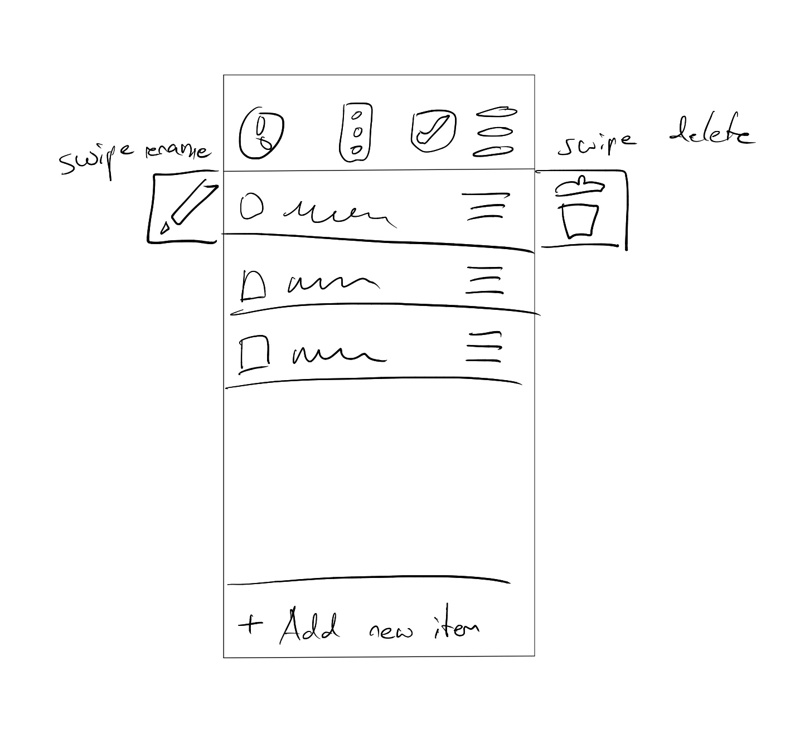

We also considered adding due date fields for each of the tasks, but we thought that might make the task too complicated and we were not sure how to display the information cleanly. This is still something we are looking into adding in the future.

We had the menu icons for each of the task items use the hamburger icon at first but many of the users we asked to test our app found the icon misleading as it is also sometimes used for movable (draggable) elements, so we changed it to the three dots icon instead.
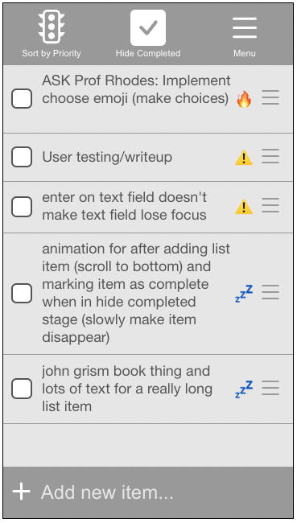

When sorting by priority level, we also considered having dividers within the task list itself to divide the tasks of high, medium, and low priority into their own sections. We did not have time to implement this but we will experiment with this to see if it makes the user experience better.

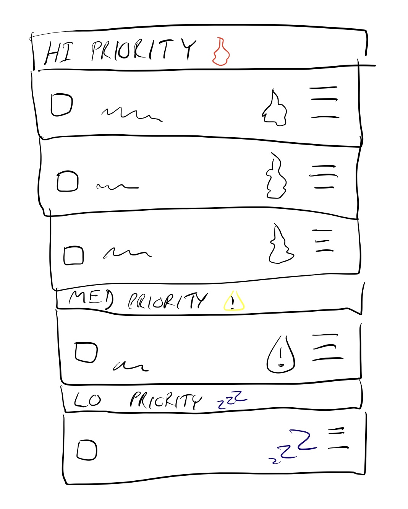

For lab 2, we initially had the "Sort by priority vs. creation" toggle and the "show/hide completed" toggles at the top of the screen. However, from user testing, we noticed that some users didn't immediately realize that our app was a todo list. Additionally, we noticed that the icons themselves were
not very useful, since users did not understand them unless they were accompanied by their text labels. Thus, we decided to change the placement of these two controls and write "Todos" at the top of the screen (see "Element Placement" section for more details).

Below is a screenshot of our lab 2 design.

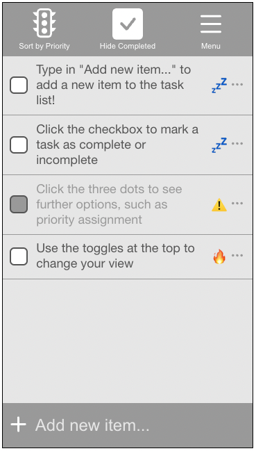

Below are screenshots of our lab 3 design.

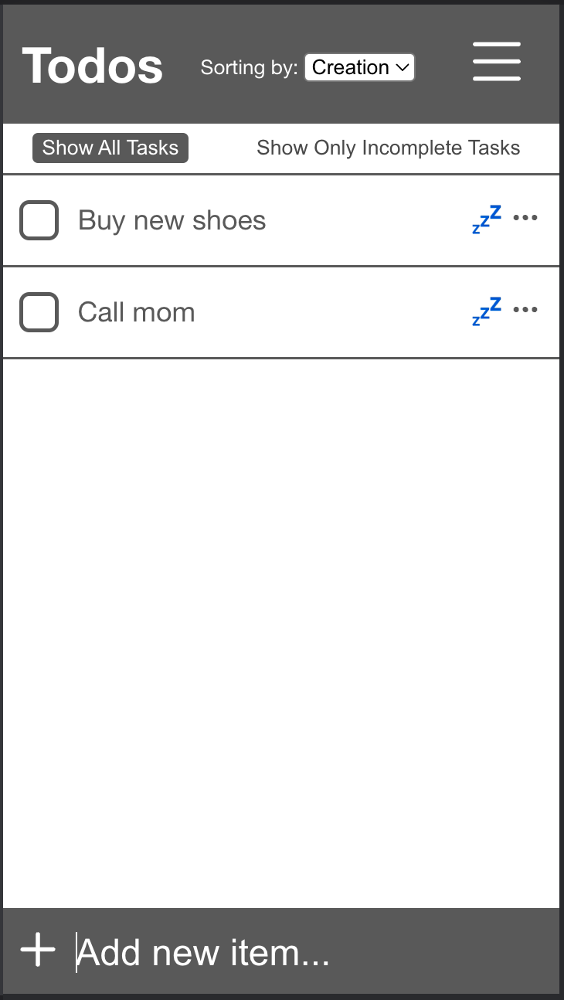
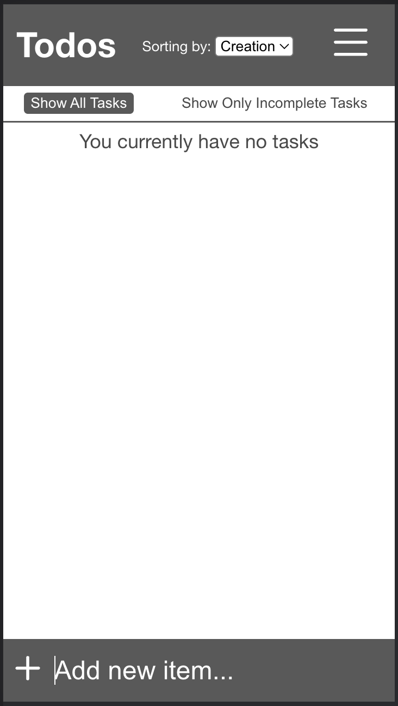
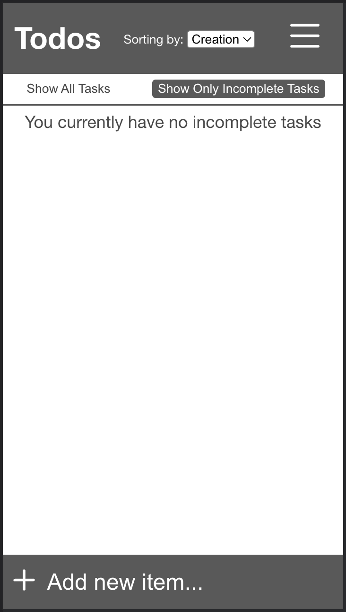
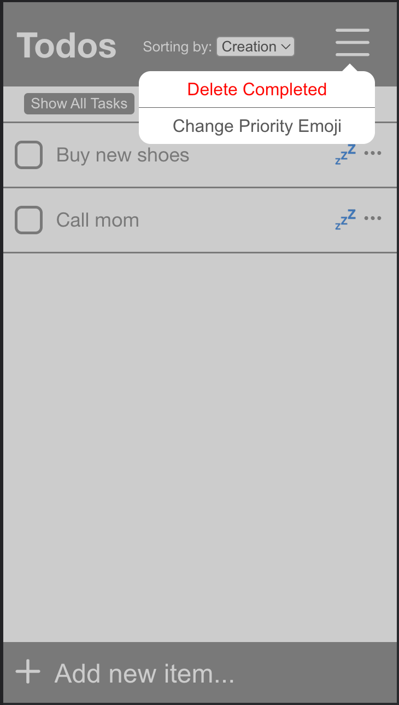
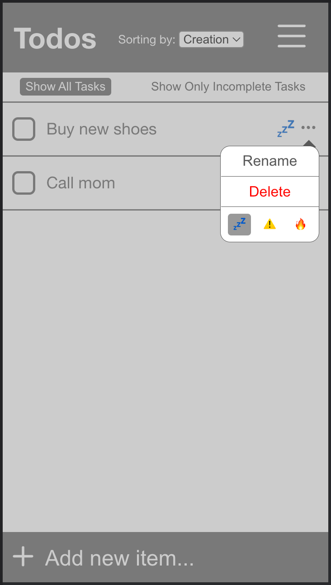
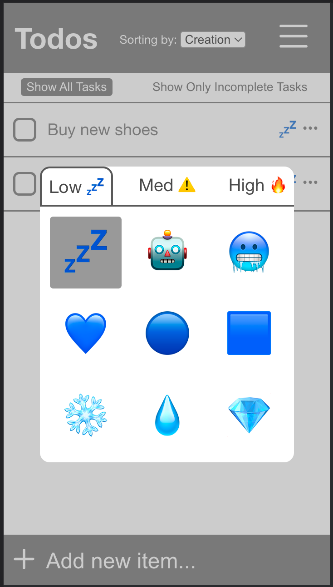

For Lab 4, initially we had a much more rounded aesthetic for the home view to differentiate it from the list view. After user testing, we decided that the difference was too drastic and we made the theme more blocky. Below is our initial rounded home view design.

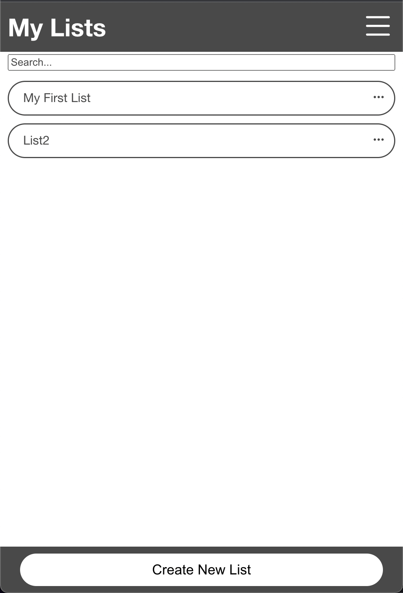
### Dark Mode and Alternative Color Themes

We also would like to implement a dark mode to invert the colors. Since our theme is greyscale, this should be easy to do without breaking the aesthetic of our app. We also would like to allow the user to choose alternative color themes if they like more colors instead of the gray.

# User Testing

## Informal Testing
Initially, we wanted to not have labels associated with the menu icons on the top bar of our app, but from our user testing, none of the users we tested the product on were able to successfully guess what the icons represented or what their functionality was. Because of this, we decided to add labels to each of our icons on the top bar. 
## Testing Group 1: Holly Chen 02/09/22
From our testing with Holly, we found that the stock emojis we selected are not immediately obvious as priority levels to everyone. At this point, our select priority emoji option to allow users to set the emoji corresponding to each priority level has not been implemented yet, but we believe that this should solve this problem and Holly agreed.

Holly also found a bug in our program where the submenu popups would pop up out of view if they were too far down the page. We later fixed this bug by making the submenu popup appear on top of the button instead if the task item is too far down the page.

Holly also mentioned wanting the ability to drag to reorder tasks in the list. We are not sure whether we want to do this yet as this would conflict with our current model for task ordering, but it is something we may look into in the future.

We also found that it is not immediately obvious that a task has been sucessfully added if the task list is long. The user would have to scroll down to see that their new task has been successfully added to the task list. To fix this, we WILL AUTOSCROLL TO THE BOTTOM.

## Testing Group 2: Keo Chui and Cole Nagata 03/02/22
Keo mentioned that the sorting icon, especially the one for sorting by priority, is not clear. It is not clear whether the filled-in stoplight means sort by priority or not. Because of this, we decided to modify the description text for that icon.

Keo also thought that the task items could be reordered by dragging on the menu icon. This made us realize that the menu "hamburger" icon is actually quite misleading as it is sometimes used to indicate that something can be moved, so we decided to change the "hamburger" menu icon to a "three dots" menu icon for the submenu for each task item instead.
## Testing Group 3: Sydney Cornell and Ruby Foxall 03/02/22
Sydney and Ruby found the app fairly intuitive, and they were able to figure out how to use the app exactly as we intended. This showed us that many of the design decisions and iterations we have made eventually did lead to a fairly intuitive, easy-to-use product.
## Testing Group 4: Kaveh Pezeshki 03/02/22
Kaveh also found the app intuitive, but only after adding a couple of task items. This made us realize that the app would benefit from a "tutorial" of sorts. Because of this, we decided to add some default task items that are already in the task list explaining to users the different functionalities of the app. These default task items would show when the user launches the app for the first time.

## Testing Group 5: Zooey Meznarich and Amy Qian 03/02/22
Initially, Zooey was not able to figure out what the buttons at the top did since there were no tasks in the task item, so it seemed like they did nothing. This can be fixed by adding default list items. Amy also said the same thing Holly said earlier about how the hamburger icon is misleading, and that we should change it to the three dots icon instead. They also mentioned that the ability to change emojis for each priority level would be nice, and that swipe quick actions would be nice. We will implement the priority level emoji selector for this lab, and we will attempt to add swipe actions in a future release.

## Testing Group 6: Ashley Tung and Claire Boege 03/23/22
The first thing Ashley said was that our app was rather grey. She said that she prefers a pop of color instead. We should note that this was before any items were added to the To-Do list, so the screen was entirely grey at this time. In the future, we plan to include an option to change the "App Theme", which will allow the user to select their own color palette, or at least the color of the top and bottom bar. 

Ashley liked the emojis and thought they were pretty intuitive, but didn't particularly like the red heart emoji ("❤️") for use in representing high priority tasks.
So, we decided to replace this emoji with a red exclamation point ("❗️"). 

Ashley also suggested implementing date-based deletion. For instance, one could create a todo list for one day, and then wish to create a fresh todo list for the next day. 
One way to implement this is allowing the user to have multiple lists in the same application, which we will implement later. However, we could also implement this by having an option to delete all tasks from a particular date. We will consider adding this feature as well in the future. 
## Testing Group 7: Liam Chalk 03/23/22
Liam understood most of our app. He immediately saw the select element to choose different sorting options, as well as the options to show/hide completed tasks. 

However, he tried to click on the priority emojis several times, and was confused by the fact that nothing happened. To address this, we made clicking on the priority emojis show the drop down as well, so that users can change the priority emojis through the sub menu when they click on the priority icon. 
At first, he was also a confused as to what the priority emojis represented. However, he figured it out when he went to the "Change Priority Emoji" screen. To address this, we initialized the todo list with a list of items in the beginning that tell users how to use the app. 
In this "tutorial", we included the meanings of the default emojis. 

## Testing Group 8: Sidhant Rastogi

Would be nice to see when the tasks are creation.

Creation is a weird word for a sorting query.

Would be nice if subnotes can be added.

The emojis aren't immediately obvious. Red Yellow Green is probably better. Low should be green (?)

Right now sorting is capital letters first

Searching case sensitivity

## Testing Group 9: Celine Wang

Celine was confused with the search bar and why new tasks were not showing up after creating tasks (when her search bar was non empty). Celine also initially thought that the search bar was an add task bar. This can be confusing because when the search bar is nonempty, it will look like entering a task into the list did nothing. A way to fix is problem is by having the search bar clear upon adding a new task. Additionally, Celine liked the feature to delete all completed tasks at once. She also mentioned that the lack of such a feature is a reason she stopped using a to-do list app in the past.

## Testing Group 10: Saatvik Sejpal and Alekzander Grijalva-Moreno
Saatvik was unable to find the "Add New List" and "Add New Task" buttons initially. This is because we placed them at the bottom of the screen. While we still believe that this is the correct design decision on the mobile view, we may move the location of this button for the desktop view as it may be more visible in a different location for that view. Saatvik also suggested changing the cursor shape to be a hand with a pointer finger when hovering over interactive/clickable elements to indicate that they can be clicked. 

Saatvik also initially thought that the search bar is the add task/list button. Since many people are having trouble with this, we believe it is better to make the search bar more explicit, perhaps by adding a magnifying glass icon.

Alekz also didn't like how different our home view and list view were. He thought that the home view was too rounded and the list view was too blocky, and that there wasn't enough consistency between the two. Upon reflection, we believe he is right and we chose to make the home view less rounded and more blocky to match the list view.

Alekz also mentioned that on a phone, when people click the text, they likely want to rename the task rather than checking/unchecking the checkbox. He also showed us an example with Apple's Reminders app. We believe that he is right and we would like to make this the default functionality for the next lab.

# Final Design

Below are screenshots of our final design.

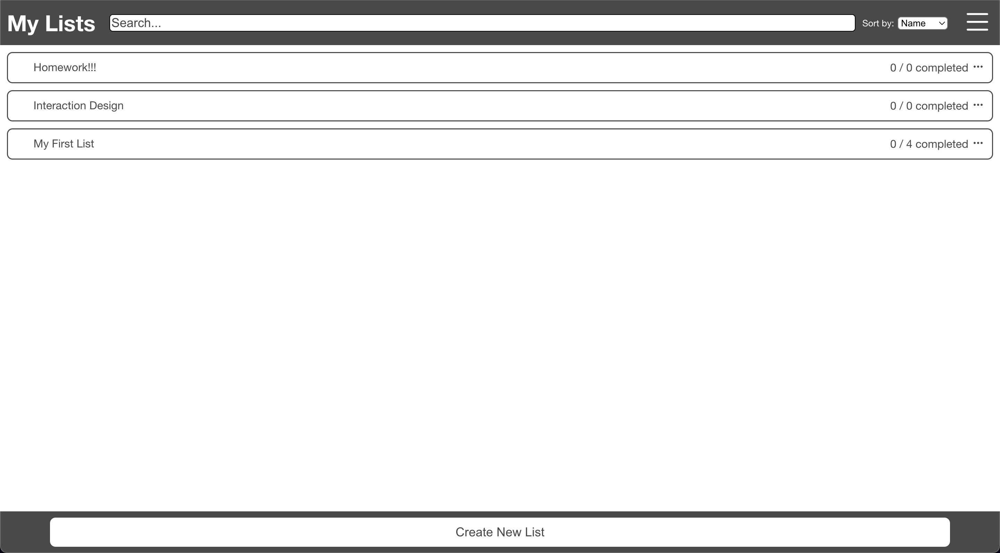
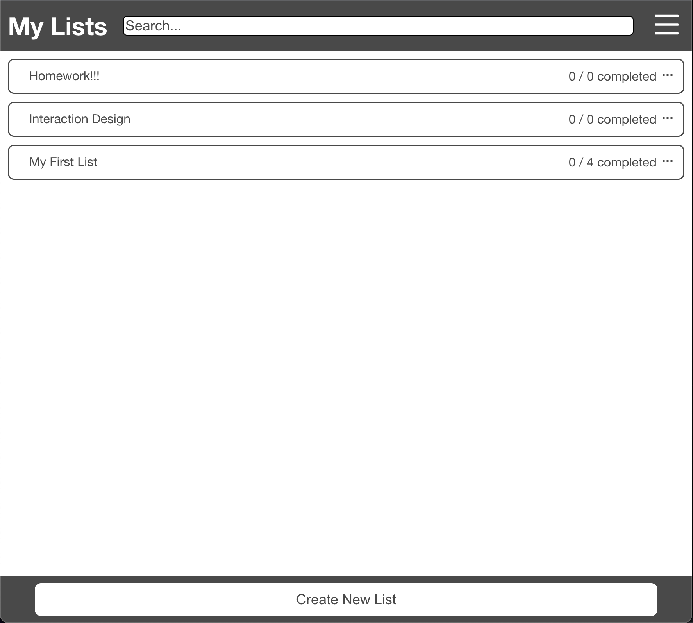
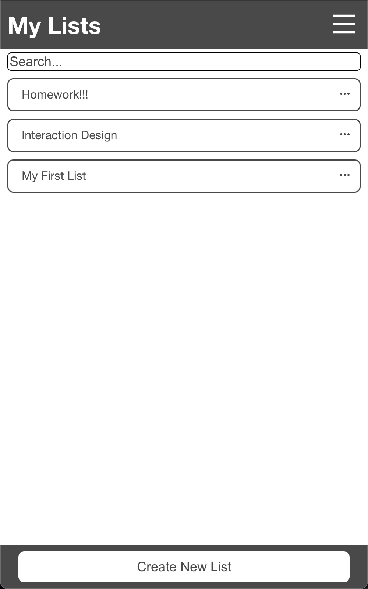
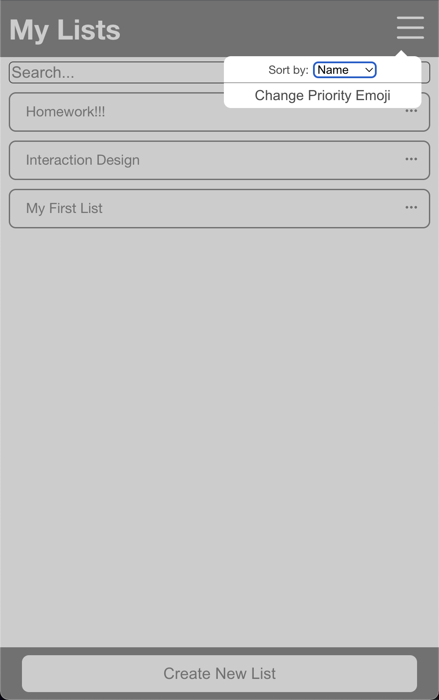
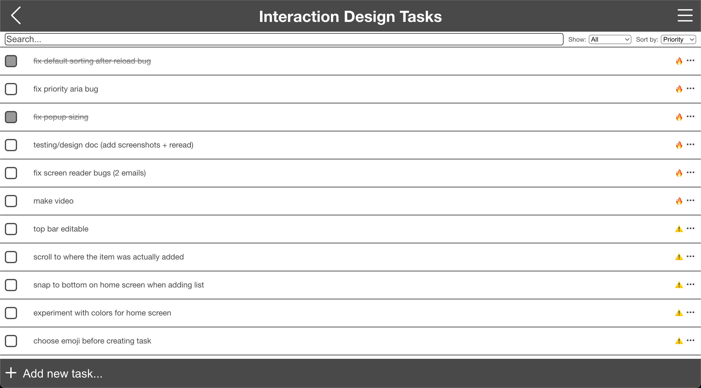
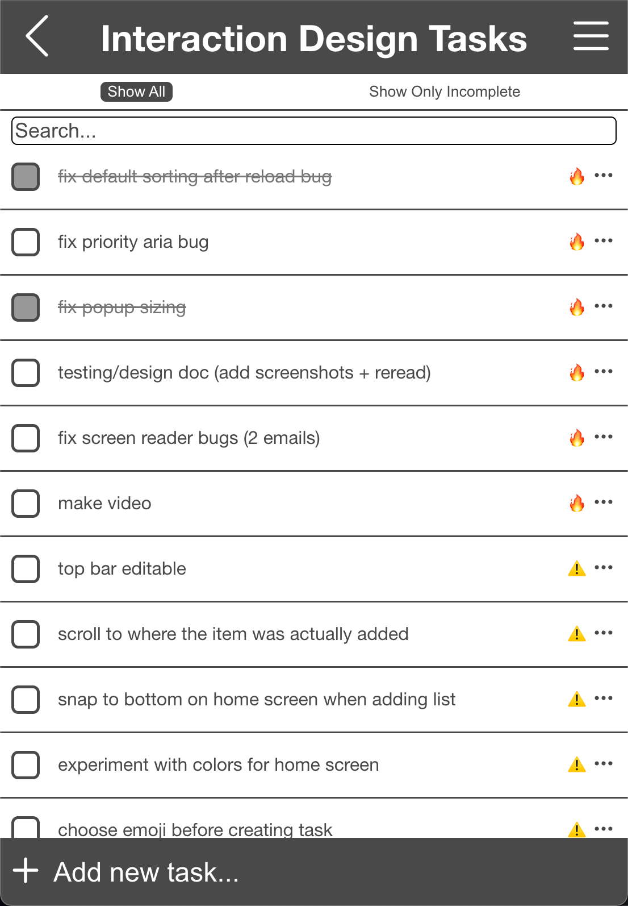

# Challenges We Faced

## Lab 1
We found the implementation of the following to be difficult/time consuming:
- Modifying the text entry box and its placeholder text
- Creating the popup box
- Creating arrows on popup boxes
- Styling the checkbox
- Making the middle section of the task list scrollable

By far the most difficult thing we tried to implement for this lab was the swipe action. We were unsure of how to accomplish this. Since this lab is mostly just for the design and it does not have to be functional yet, we decided to give up on this feature for now and we will try to implement it in future labs.

## Lab 2
We found the implementation of the following to be difficult/time consuming:
- Making the text field of a list item activate the checkbox and not editable through direct clicking
- Making the dropdown element appear on top/bottom depending on screen position
- Making an auto-resizing textarea field that is not editable

## Lab 3
We found the implementation of the following to be difficult/time consuming:
- Activating and initializing the Firestore database from the Firebase console.
- Understanding how useEffect works, and when exactly it was called. We had to remind ourselves that useEffect is called AFTER every rerender, not during every rerender. 

# Parts of the Design we are most proud of

We are especially proud of the emoji indicators for priority level, as well as the ability of the user to customize their own emojis if they prefer. 

We are also proud of the fact that our app autoscrolls to the end of the list when a user adds a new item that causes the list to take up more space than all the list items can fit into. This required us to fully understand how the .then() part of useEffect() works.

We are also happy with the grey theme we went with as it is very neutral and it should mesh well with any of the priority level icon emojis, especially since we will allow users to change these emojis themselves if they would like to.